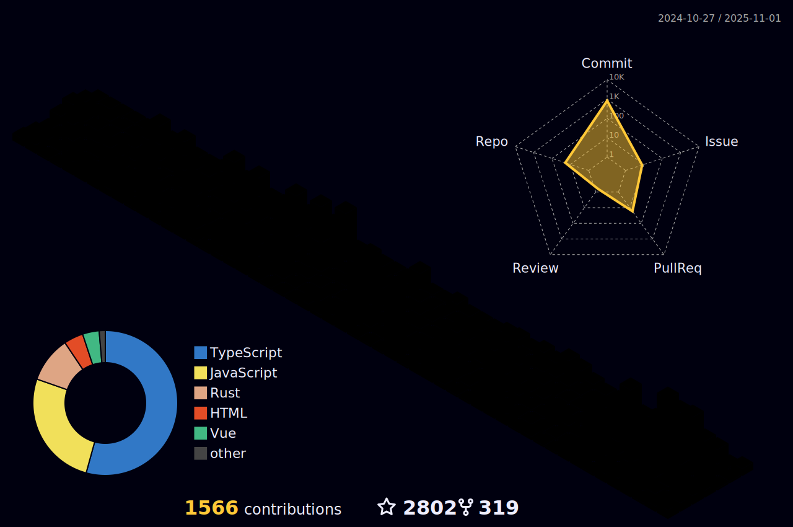

[English](/README.md) | 简体中文

<h2 height="200px" align="center">Sunny </h2>
<h2 align="center">A passionate frontend developer from China</h3>

  
  
  
  
  
  
  
  
  
  

  
  
  
  
   
   
   

 

# <a href="https://jzq422bol5.feishu.cn/docx/doxcnyogD4POabvLHoa1yoEH9W0">Sunny's instructions</a>

- 🧱 Work Experience：didi(2021) ✈️ bytedance(2022) ✈ baidu(2023)
- 🚀 前端历险记：https://sunny-117.github.io/blog/
- 🚀 迷你前端源码库: https://sunny-117.github.io/mini-anything-docs/
- 📦️ 纯基础知识沉淀 https://sunny-117.github.io/
- ✨  [掘金专栏](https://juejin.cn/user/2551305355400797/columns)  [牛客网](https://www.nowcoder.com/users/363848192)  <a href="https://space.bilibili.com/447694807" target="_blank">bilibili</a>
- 🎉 你若盛开，清风自来；相约而至，风雨无阻，漫漫岁月，赤子之心
- 🎉 天下大势，成久必败，败久必成，无论成与败，努力就好，一切随缘
- 💬 微信：**19811715506**，欢迎交流

# Open Source

## JavaScript programming 

- [js-challenges](https://github.com/Sunny-117/js-challenges) ：✨ 一步步挑战你的 `JavaScript`编程极限 

- [Native-project](https://github.com/Sunny-117/Native-project)：🔧 原生 JavaScript 项目集合 

## Technical articles

- [mini-anything 迷你前端源码库](https://github.com/sunny-117/mini-anything) ：🚀 集合了前端领域的各种迷你版本的库，探索前端库源码，实现超级迷你版本，只包含原库的主流程，不包含边界 case       
- [前端历险记](https://sunny-117.github.io/blog/)：Sunny 写博客的地方

## React Hooks

- [shooks](https://github.com/Sunny-117/shooks)：📦️ 一款高质量，可靠的 React Hooks 库

## compiler

- [tiny-complier](https://github.com/Sunny-117/tiny-complier)：实现超级 mini 的编译器，灵感来自于[the-super-tiny-compiler](https://github.com/jamiebuilds/the-super-tiny-compiler)

## Starter Templates

## VS Code Extensions

- [vsc-delete-func](https://github.com/Sunny-117/vsc-delete-func)：🍻 vscode plugins

## TypeScript lib

- [lodash-ts](https://github.com/Sunny-117/lodash-ts)：🎉 一致性、模块化、高性能的 JavaScript 实用工具库。本仓库完成 lodash 的 typescript 版本，只实现 lodash 中漂亮的函数，集成 Vitest 单元测试

## plugin

- [babel-plugin-dev-debug](https://github.com/Sunny-117/babel-plugin-dev-debug)：an babel plugin that for dev debug

## ESLint

- [eslint-plugin-reviewget](https://github.com/Sunny-117/eslint-plugin-reviewget)：🚀eslint-plugin

## CLI

## SDK

- [Speed-measuring-gadget](https://github.com/Sunny-117/Speed-measuring-gadget)：一款测网速小工具，同时它具有测试内外网的能力

  

# Github Status

