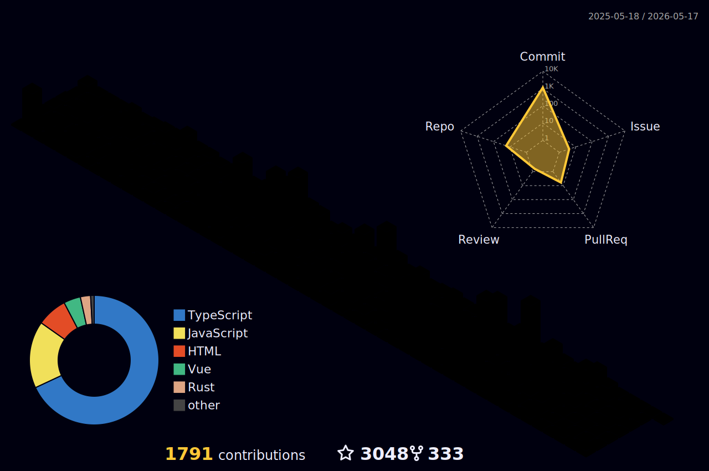

  
Hi! I'm Sunny-117, a passionate frontend developer who loves to build things from scratch.

  
In-depth research, do what you say

  

    
    
  

## About Me

- 🧱 Work Experience：didi(2021) ✈ bytedance(2022) ✈️ baidu(2023-present)
- 🚀 Frontend Adventures: https://sunny-117.github.io/blog/
- 🚀 Tiny-anything: https://sunny-117.github.io/tiny-anything/
- 📦️ Basic knowledge: https://sunny-117.github.io/
- ✨ [juejin](https://juejin.cn/user/2551305355400797/columns)  [nowcoder](https://www.nowcoder.com/users/363848192)
- 💬 WeChat：**19811715506**

## <a href="https://sunny-117.github.io/blog/getting-started.html">My Projects</a>

-  [js-challenges](https://github.com/Sunny-117/js-challenges): Challenge your JavaScript programming limits step by step
-  [tiny-anything](https://github.com/Sunny-117/tiny-anything): Explore the source code of frontend libraries and implement super mini versions
-  [BOSScript](https://github.com/Sunny-117/BOSScript): One-click batch resume submission script for Boss Zhipin
-  [blog](https://github.com/Sunny-117/blog): Frontend adventures blog
-  [awesome-native](https://github.com/Sunny-117/awesome-native): Collection of native JavaScript projects
-  [tiny-vite](https://github.com/Sunny-117/tiny-vite): Lightweight frontend build tool with dual-engine architecture, esbuild pre-bundling, HMR, plugin system
-  [create-rolldown](https://github.com/Sunny-117/create-rolldown): Scaffolding tool for Rolldown library projects
-  [robuild](https://github.com/Sunny-117/robuild): Zero-config ESM/TS package builder powered by Oxc and Rolldown
-  [tiny-webpack](https://github.com/Sunny-117/tiny-webpack): A JavaScript bundler with Webpack-like features
-  [vite-plugin-oxc](https://github.com/Sunny-117/vite-plugin-oxc): Oxc integration for Vite
-  [vite-plugin-ai-doctor](https://github.com/Sunny-117/vite-plugin-ai-doctor): AI-powered error diagnosis plugin for Vite builds
-  [bundler-labs](https://github.com/Sunny-117/bundler-labs): Bundler experiments and labs
-  [abtest-kit](https://github.com/Sunny-117/abtest-kit): Lightweight A/B testing SDK with multiple traffic splitting strategies and React integration
-  [tiny-react](https://github.com/Sunny-117/tiny-react): The closest implementation to the React source code
-  [rc-design](https://github.com/Sunny-117/rc-design): A component library developed for React
-  [network-speed-js](https://github.com/Sunny-117/network-speed-js): A small tool for testing network speed
-  [eslint-plugin-react-boundary](https://github.com/Sunny-117/eslint-plugin-react-boundary): ESLint plugin to ensure React components are wrapped with Boundary
-  [eslint-plugin-react-pure-export](https://github.com/Sunny-117/eslint-plugin-react-pure-export): ESLint plugin to enforce separation between React components and pure logic modules
-  [tiny-vue](https://github.com/Sunny-117/tiny-vue): Vue 3 design philosophy and source code exploration
-  [tiny-compiler](https://github.com/Sunny-117/tiny-compiler): Implement a super mini compiler in just 200 lines of code
-  [jsx-compilation](https://github.com/Sunny-117/jsx-compilation): A compiler that transforms JSX syntax to JS syntax
-  [oxc-loader](https://github.com/Sunny-117/oxc-loader): webpack/Rspack loader for Oxc
-  [mini-rspack](https://github.com/Sunny-117/mini-rspack): A simplified webpack bundler using Rust
-  [v8-rs](https://github.com/Sunny-117/v8-rs): Minimal viable JavaScript engine in Rust with JIT compilation
-  [rsdown](https://github.com/Sunny-117/rsdown): High-performance JavaScript/TypeScript transformer based on Rust and SWC
-  [chat-rs](https://github.com/Sunny-117/chat-rs): Simple real-time chat system built with Rust
-  [es-module-lexer-rs](https://github.com/Sunny-117/es-module-lexer-rs): A Rust implementation of es-module-lexer with Node.js bindings
-  [browser-core](https://github.com/Sunny-117/browser-core): Implement a minimal browser rendering model
-  [draw-wasm](https://github.com/Sunny-117/draw-wasm): A drawing board implemented with WebAssembly
-  [text-image](https://github.com/Sunny-117/text-image): Convert text, images, and videos into ASCII art
-  [dev-server-proxy](https://github.com/Sunny-117/dev-server-proxy): Dynamic proxy middleware with hot-swapping proxy configurations without restart
-  [cli](https://github.com/Sunny-117/cli): CLI tool
-  [esfinder](https://github.com/Sunny-117/esfinder): Import dependency analyzer for JS/TS based on Babel, SWC, and Oxc
-  [startar](https://github.com/Sunny-117/startar): Interactive scaffolding tool for quickly pulling TypeScript project templates
-  [browser-storage-lru-cleaner](https://github.com/Sunny-117/browser-storage-lru-cleaner): Browser storage auto-cleanup SDK using LRU algorithm
-  [outilx](https://github.com/Sunny-117/outilx): A modern, modular utility library collection for JavaScript/TypeScript
-  [text-processor](https://github.com/Sunny-117/text-processor): Rust-based text processor for flexible text processing and conversion
-  [lite-tracker](https://github.com/Sunny-117/lite-tracker): Frontend monitoring SDK from scratch
-  [ureq](https://github.com/Sunny-117/ureq): A modern, modular HTTP request library
-  [webcontainer-ide](https://github.com/Sunny-117/webcontainer-ide): Browser-based development environment powered by WebContainer
-  [chunkflow](https://github.com/Sunny-117/chunkflow): Large file upload solution with chunked upload, resumable upload, and instant upload
-  [electron](https://github.com/Sunny-117/electron): Electron desktop application development guide
-  [streamsight](https://github.com/Sunny-117/streamsight): User behavior recording and playback system based on rrweb
-  [json-visual-diff](https://github.com/Sunny-117/json-visual-diff): JSON visual diff SDK with pluggable renderer architecture
-  [doc-render-sdk](https://github.com/Sunny-117/doc-render-sdk): Component documentation site SDK based on Vite + robuild + React
-  [rka](https://github.com/Sunny-117/rka): A component that maintains component state and avoids repeated re-rendering
-  [rspack-circular-dependency-plugin](https://github.com/Sunny-117/rspack-circular-dependency-plugin): Detect circular dependencies in modules compiled with Rspack
-  [nodemon-rs](https://github.com/Sunny-117/nodemon-rs): A fast implementation of nodemon in Rust
-  [QuickNote](https://github.com/Sunny-117/QuickNote): Lightweight macOS menu bar note app based on Rust
-  [MicroFE](https://github.com/Sunny-117/MicroFE): Micro frontend framework
-  [30-seconds-of-rs](https://github.com/Sunny-117/30-seconds-of-rs): 30 seconds to collect useful Rust snippets

---

